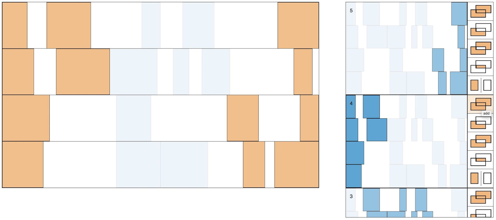

# Visual Selection History

## [Demo](https://acarabott.github.io/selection-history)

A UI experiment in visualsing the selection history, designed for tasks that require complex selections e.g. video editing, audio production, graphic design.

Eliminates the fear of losing your carefully selected set of elements, allows for treating selections as groups *without having to remember to create groups*.

Inspired by ideas in Jef Raskin's <a href="https://en.wikipedia.org/wiki/The_Humane_Interface">The Humane Interface</a> (p. 106-107)
